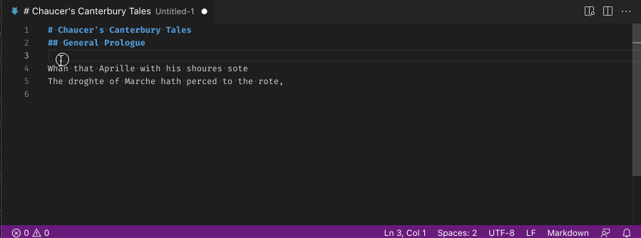

# ruby-html-tag for VS Code

This <ruby>extension<rt>very tiny</rt></ruby> makes it easier to deal with adding `<ruby>` HTML tags to your documents (HTML, Markdown, etc.). I'm not talking about the programming language, but the small text rendered above other text, typically used by documents in East Asian languages and called <ruby>ルビ文字<rt>ruby moji</rt></ruby>: see [MDN](https://developer.mozilla.org/en-US/docs/Web/HTML/Element/ruby) as well as [@kosamari](https://twitter.com/kosamari/status/743473313184419845).

## Features

1. Select a word.
2. Open the [Command Palette](https://code.visualstudio.com/docs/getstarted/userinterface#_command-palette) (⇧⌘P or Ctrl+Shift+P).
3. Type "Add Ruby and Rt Tags" and hit Enter.
4. Your word will be wrapped in `<ruby>` tags and the <ruby>ruby text<rt>this stuff</rt></ruby> is left selected for you to overwrite.

If you skip step 1, i.e., don't select anything, we try to do something sensible:
- if you're at a word, we select the entire word for you wrap it in `<ruby>` tags.
- If there's no word at your cursor, we insert a blank `<ruby>` and `<rt>` tags.

## Known Issues

When the width of the window is *just right*, the "RUBY TEXT" isn't fully selected. Please help.

## Release Notes

### 1.0.0

Initial release.
